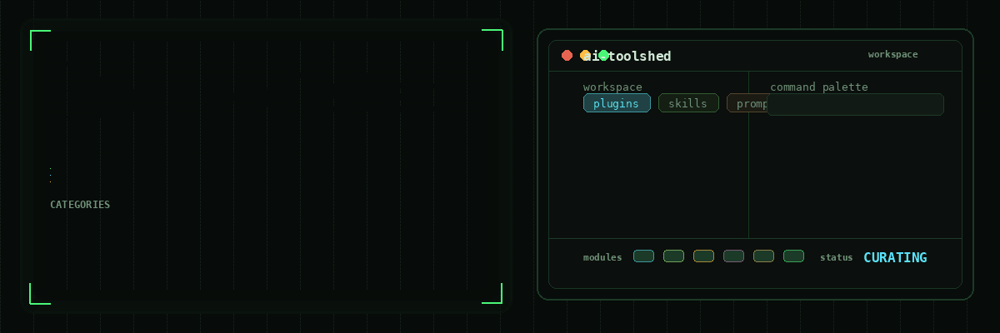

# AI Toolshed

Practical, reusable tools for working better with AI.

This monorepo collects skills, plugins, and standalone tools that make collaboration with AI systems more rigorous, useful, and repeatable. Each project is designed around a real workflow, explicit evidence, and verifiable outputs rather than a generic prompt.

## What's inside

| Type | Project | Purpose |
| --- | --- | --- |
| Skill | [project-teardown](skills/project-teardown/) | Use a software product like a real user, inspect its implementation, judge its product and market position, and produce a severity-ordered, implementation-ready teardown. |
| Skill | [project-revision](skills/project-revision/) | Revalidate an approved project teardown, resolve owner decisions, implement findings in dependency order, and converge the result into an auditable readiness handoff. |
| Skill | [seo-teardown](skills/seo-teardown/) | Investigate technical SEO, content, authority, local and AI-mediated discovery, measurement, and qualified-conversion opportunity without changing the site. |
| Skill | [seo-revision](skills/seo-revision/) | Revalidate and implement approved SEO findings, respect repository and external-action boundaries, verify search eligibility, and produce a durable revision and experiment record. |
| Skill | [brand-teardown](skills/brand-teardown/) | Audit positioning, differentiation, architecture, messaging, trust, identity, claims, channel expression, and competitive context without changing the audited project. |

The skills include two implemented teardown/revision workflows and one standalone teardown:

```text
project-teardown  -> project-revision
seo-teardown      -> seo-revision
brand-teardown    -> validated implementation handoff
```

> [!IMPORTANT]
> **The five skills aren't one pipeline with irrelevant stages; they're independent audits you choose between.**
>
> The arrows above pair a teardown with the skill that implements its findings. They do not mean a project runs through all five. A terminal agent has no SEO surface, so `seo-teardown` never applies to it; a static marketing site has no CLI surface for `project-teardown` to exercise. Pick the audit that matches what you are actually asking about, and ignore the rest.

The teardown skills are comprehensive and read-only. The revision skills consume validated handoffs, request decisions where needed, implement only approved work, and verify the resulting state without claiming unproven outcomes.
No `brand-revision` skill is implemented yet; `brand-teardown` defines the evidence and authority boundary a future revision workflow must preserve.

The repository is organized by artifact type:

```text
ai-toolshed/
├── assets/
└── skills/
    ├── project-teardown/
    ├── project-revision/
    ├── seo-teardown/
    ├── seo-revision/
    └── brand-teardown/
```

Each skill is self-contained and includes its instructions plus any validators, renderers, references, tests, or interface metadata it needs.

## Install

Every skill in this repository is written to the Claude-standard `SKILL.md` frontmatter contract (`name` and `description` only) and is dependency-free, so the same bundle installs into either runtime. Install on the same host where the agent runtime actually runs: a skill copied inside WSL is not visible to a Windows IDE extension, and vice versa.

The commands below replace each destination completely, so files removed from the repository cannot survive as stale installed files. Back up local edits inside an installed skill first; replacement deletes them.

```bash
git clone https://github.com/sudotsu/ai-toolshed
cd ai-toolshed
```

### Claude Code

Claude Code discovers user-level skills under `$HOME/.claude/skills`.

```bash
mkdir -p "$HOME/.claude/skills"
for skill in project-teardown project-revision seo-teardown seo-revision brand-teardown; do
  rm -rf -- "$HOME/.claude/skills/$skill"
  cp -R "skills/$skill" "$HOME/.claude/skills/$skill"
done
```

Each skill is independent and installs on its own. To scope them to a single repository instead of the whole machine, copy them into that repository's `.claude/skills/` directory rather than `$HOME`.

One flag matters for project-scoped installs. `seo-revision` revalidates its input handoff by running `seo-teardown`'s validator, and it looks for that validator in user-level skill roots only — it ignores a copy inside the repository under audit, so that the audited project cannot supply the rules it is checked against. If both skills live in a project's `.claude/skills/`, pass `--seo-teardown-skill .claude/skills/seo-teardown`. A user-level install needs nothing extra; the skills find each other as siblings.

If you relocate the Claude configuration directory with `CLAUDE_CONFIG_DIR`, install into `$CLAUDE_CONFIG_DIR/skills` instead of `$HOME/.claude/skills`; the skills honor that variable when resolving each other.

Start a new Claude Code session so the skills are discovered, then invoke one by name:

```text
Use project-teardown to comprehensively evaluate this project.
Use project-revision to implement the approved teardown findings.
Use seo-teardown to investigate this site's organic-search opportunity.
Use seo-revision to implement the approved SEO teardown findings.
Use brand-teardown to audit this project's brand system without changing it.
```

Claude Code may also select a skill on its own when a request matches its `description`. The teardown skills are read-only by contract; the revision skills change files only after you approve findings.

### Codex CLI or the IDE extension

Codex discovers user-level skills under `$HOME/.agents/skills`.

From WSL or another POSIX shell:

```bash
mkdir -p "$HOME/.agents/skills"
for skill in project-teardown project-revision seo-teardown seo-revision brand-teardown; do
  rm -rf -- "$HOME/.agents/skills/$skill"
  cp -R "skills/$skill" "$HOME/.agents/skills/$skill"
done
```

From Windows PowerShell:

```powershell
$skillRoot = Join-Path $HOME ".agents\skills"
New-Item -ItemType Directory -Force -Path $skillRoot | Out-Null
foreach ($skill in "project-teardown", "project-revision", "seo-teardown", "seo-revision", "brand-teardown") {
  $destination = Join-Path $skillRoot $skill
  if (Test-Path -LiteralPath $destination) {
    Remove-Item -LiteralPath $destination -Recurse -Force
  }
  Copy-Item -LiteralPath (Join-Path "skills" $skill) -Destination $destination -Recurse
}
```

Codex normally detects skill changes automatically. List available skills with `/skills`, or invoke one explicitly with `$`:

```text
Use $project-teardown to comprehensively evaluate this project.
Use $project-revision to implement the approved teardown findings.
Use $seo-teardown to investigate this site's organic-search opportunity.
Use $seo-revision to implement the approved SEO teardown findings.
Use $brand-teardown to audit this project's brand system without changing it.
```

### Other agents and platforms

These install paths cover Claude Code and Codex. Cloning or copying this repository does not add these skills to a ChatGPT or Claude.ai account. Read each skill's `SKILL.md` before adapting it to another agent: capabilities, authority boundaries, and packaging conventions differ.

## What's coming next

The next additions are being selected from working skill packages already used across Claude Code, Codex, and Gemini environments. This is a roadmap, not a promise to publish local folders unchanged: every candidate must be generalized, hardened, documented, and tested to the same standard as the teardown and revision skills before it lands here.

The strongest pipeline currently looks like this:

```text
lead-architect
├── backend-expert
├── frontend-expert
├── devops-sre
└── qa-testing

digital-product-launcher
skill-portability
```

| Planned skill | What it will add | Why it made the cut | Required before publication |
| --- | --- | --- | --- |
| `lead-architect` | Spec-driven decomposition, specialist coordination, handoff contracts, and separate compliance and quality reviews for complex builds. | It already has an explicit operating law, staged workflow, failure escalation, model-selection guidance, and adversarial evals. | Remove runtime-specific assumptions, define durable handoff schemas, and add validator-backed completion gates. |
| `backend-expert` | Secure API and data-system design with transaction, idempotency, concurrency, authorization, and query-performance checks. | It already combines a concrete workflow with architecture and security references plus pressure, refactoring, and adversarial evals. | Generalize beyond one stack, replace absolute rules with evidence-aware policy, and validate generated implementation specs. |
| `frontend-expert` | Accessible, resilient, performance-aware frontend planning and implementation with explicit server/client and async-state boundaries. | It already carries accessibility, performance, and resilience references plus three behavior-focused evals. | Make framework rules version-aware, support non-React projects, and add measurable accessibility and performance verification. |
| `devops-sre` | Environment fingerprinting, change impact analysis, secret-safe infrastructure work, dry runs, rollback planning, and reliability verification. | It already includes a host fingerprint tool, a security/reliability contract, and adversarial infrastructure evals. | Make fingerprinting cross-platform, formalize destructive-action approvals, and test rollback and secret-handling guarantees. |
| `qa-testing` | Behavior-first test strategy, deterministic async testing, integration boundaries, adversarial coverage review, and regression handoffs. | It already has a testing-strategy reference and evals for flaky, over-mocked, and superficially complete suites. | Relax dogmatic test rules where the evidence calls for it, define bounded test budgets, and validate the resulting coverage record. |
| `digital-product-launcher` | Live-market research, monetization-model selection, pricing, payment constraints, launch sequencing, landing-page copy, and email funnels. | It already routes through seven substantial reference guides instead of producing generic launch advice. | Remove project- and vertical-specific assumptions, add evidence citation and freshness rules, and separate planning from authorized external actions. |
| `skill-portability` | Package one workflow for Claude Code, Codex, and Gemini while preserving metadata, tool permissions, MCP configuration, references, and install behavior. | Cross-runtime skill drift is a real recurring problem, and the local tooling demonstrates a viable analyze-transform-validate workflow. | Use a provenance-safe implementation, document each runtime's supported contract, and add round-trip fixtures that detect lossy conversion. |

### Publication gate

A roadmap candidate ships only when it is:

- reusable outside the project that created it;
- explicit about scope, authority, destructive actions, and external side effects;
- organized around a concrete workflow and durable output contract;
- bundled with the references, scripts, templates, or assets required to work independently;
- covered by realistic evals or regression tests, with validators where deterministic artifacts are part of the contract;
- portable across the hosts and runtimes it claims to support; and
- clear on provenance, licensing, current-documentation requirements, and known limitations.

Prompt-only personas, project-private operating instructions, copied vendor bundles, and unverified experiments do not enter the catalog just because they happen to live in a skills directory.

## Contributing

Issues and pull requests are welcome. See [CONTRIBUTING.md](CONTRIBUTING.md) for the repository conventions.

## License

[MIT](LICENSE)
